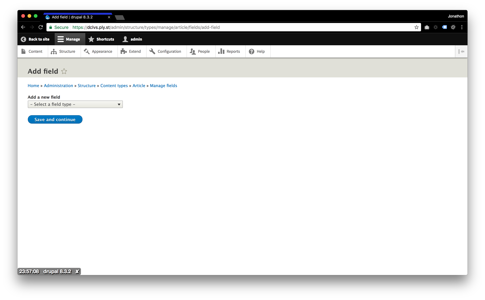

# Content Types

Content types typically contain the main content of a page on a Drupal site.

## Content Entities

According to [Drupal.org - Content Entities and Fields](https://www.drupal.org/docs/user_guide/en/planning-data-types.html):

> A content entity (or more commonly, entity) is an item of content data, which can consist of text, HTML markup, images, attached files, and other data that is intended to be displayed to site visitors. Content entities can be defined by the core software or by modules.

> Content entities are grouped into entity types, which have different purposes and are displayed in very different ways on the site. Most entity types are also divided into entity sub-types, which are divisions within an entity type to allow for smaller variations in how the entities are used and displayed.

## Adding a Content Type

1. Navigate to `Structure` -> `Content Types`. The Content types page appears showing all the available types of content.
2. Click `Add Content Type`.

## Field Types

| General | Number | Reference | Text |
| ---- | ---- | ---- | ---- |
| Boolean | List (float) | Content | List (Text) |
| Comments | List (integer) | File | Text (formatted) |
| Date | Number (decimal) | Image | Text (formatted, long)|
| Email | Number (float) | Taxonomy Term | Text (formatted, long, with summary)|
| Link | Number (integer) | User | Text (plain)|
| Timestamp |  | Other... | Text (plain, long)|

## Adding Fields to a Content Type

1. Navigate to `Structure` -> `Content Types`. The Content types page appears showing all the available types of content.
2. Click `Manage Fields` link in the dropdown for the Operations column.
3. Click `Add field`.

## Additional Resources
- [drupal.org - Concept: Reference Fields](https://www.drupal.org/docs/user_guide/en/structure-reference-fields.html)
- [drupal.org - Adding a Reference Field](https://www.drupal.org/docs/user_guide/en/structure-adding-reference.html)

---

##### [Next Page >>](2.2-display-modes.md)
