# Views

There is a lot of functionality around views. It is recommended you read through the official [Views Module](https://www.drupal.org/docs/8/core/modules/views) documentation.

This guide will just cover the bare functionality.

## What Are Views?

From [drupal.org - Views overview](https://www.drupal.org/docs/8/core/modules/views/overview):

> Using the Views module, you can fetch content from the database of your site and present it to the user as lists, posts, galleries, tables, maps, graphs, menu items, blocks, reports, forum posts etc. Different content types including nodes, users, and other bundles can be displayed.
>
> Views UI, a submodule within Views, provides a graphical interface underneath which lies a powerful SQL query builder that can access virtually any information in your database and display it in any format.
>
> Different displays can present the query results as pages with fixed URLs on your site (or URLs accepting arguments), blocks, feeds, or panel panes.

## Existing Views

If you enable the `Views UI` module you can see all views in your system by going to `Structure` -> `Views`.

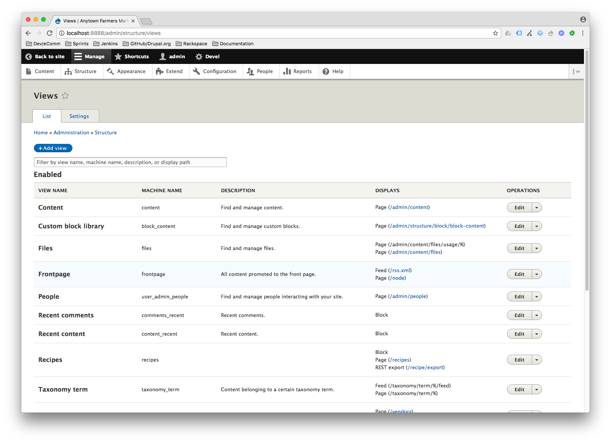

You can edit or delete a view by clicking the respective link for the view you wish to manipulate.

By editing a view, you can see the various components of a view:

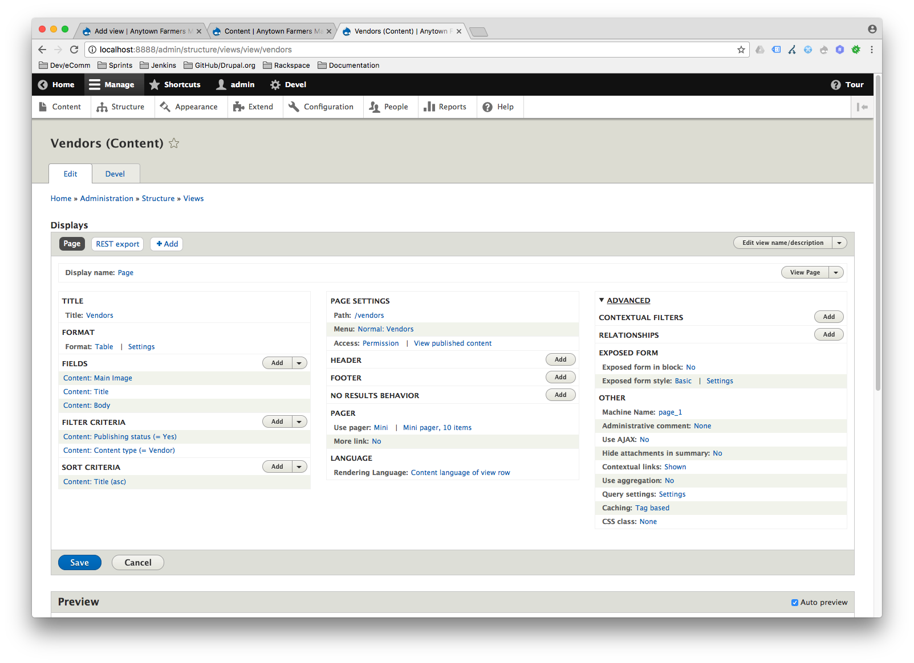

## Adding a New View

- You can add a new view by going into `Structure` -> `Views` -> `Add`.

  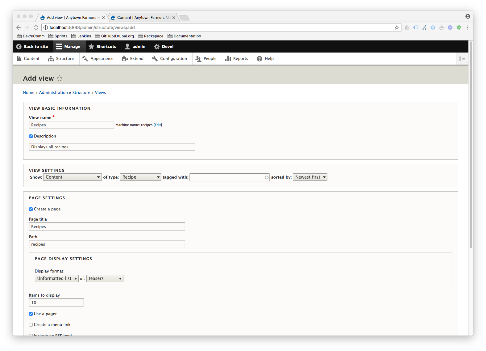

  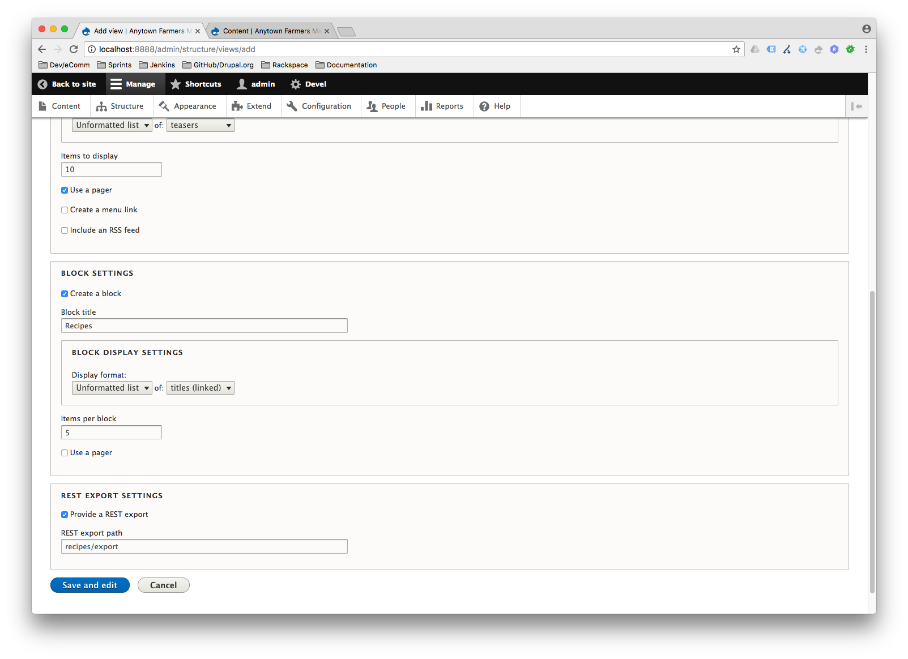

## Displays

- The various displays inside a view:

  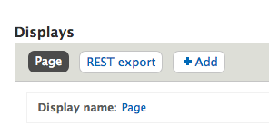

  You can add additional displays clicking the `Add` button.

- You can also use the views display menu for more options:

  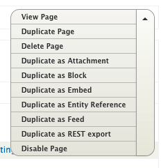

- A display's title can be set here:

  

- Additionally each display may have settings specific to the display type:

  - Page Display:

    

  - Rest Export Display Settings:

    

## Format

- Depending on the format of your view, your view output can vary widely. Some include the ability to output specific fields, and others include options to output entities themselves. You will find the format here:

  

  

- By clicking the current format name you can change the format being used:
  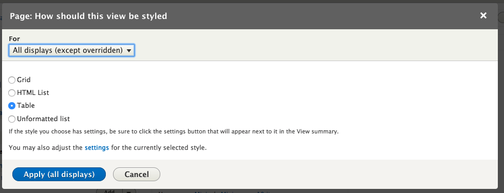

- Depending on your settings, you may have the ability to add fields for display:
  

- By clicking the `Add` button you can choose from a large list of all available fields. (Note: You can add a field to just the particular display you are on, or all displays).

  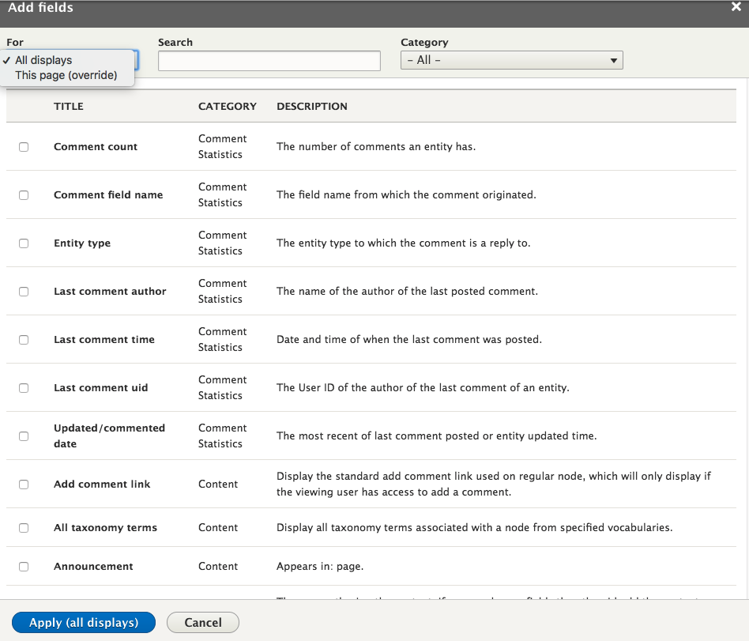

## Filtering and Sorting

- You can use certain fields and other criteria for filtering and sorting your results. (Note: You can "expose" filters and sorting criteria in a view, to allow users to specify these values dynamically)

  

  

- By clicking the `Add` button you can choose from a large list of all available fields, filters and sorting criteria. (Note: You can add a field to just the particular display you are on, or all displays).

  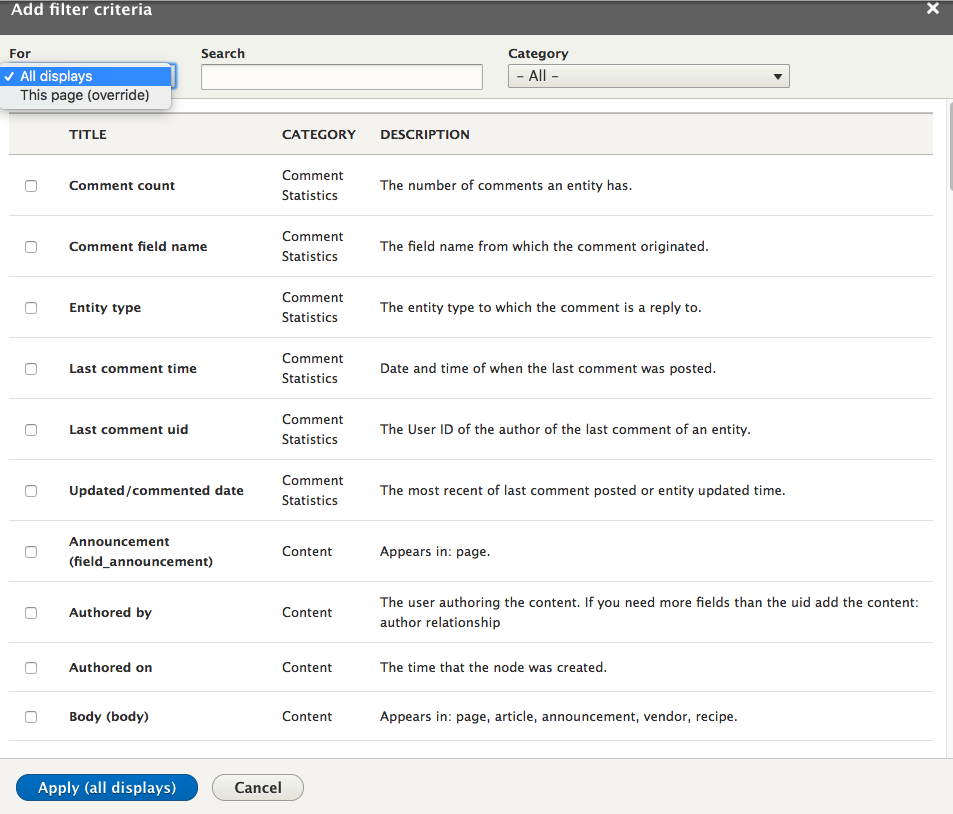

## Headers/Footers/No Results

- You can specify specific content for the views header, footer and also define the behavior when a view returns no results:

  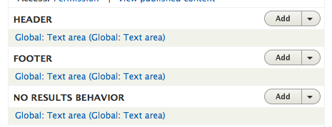

## Pager

- You can set pagination settings for your view results.

  

## Language

- If your site is configured for [Multilingual](2.8-multilingual.md) support, you can specify language-specific settings for your results.

## Advanced

The advanced section provides functionality useful in more advanced use cases.

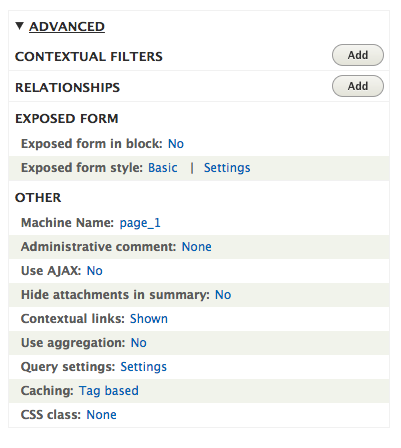

### Contextual Filters

From [drupal.org - Contextual filters](https://www.drupal.org/node/1578558):

> Views is a highly flexible module to start with, but the contextual filters increase the use cases for the module by an order of magnitude. Contextual filters work similarly to regular filters, but there is one important difference. Instead of setting a filter value manually, the value is fetched from variables sent programmatically to the view. A regular filter could give you all nodes written by a specified user. A contextual filter for a node author would be able to display all nodes written by the currently viewed user, or the same user who wrote the currently viewed node. The concept is that contextual filters prepare a view for filtering, but the filter value is not yet determined. When the view is eventually called, it is also provided with data used to complete the contextual filters.

### Relationships

You can use Relationships to make connections from your view results to other entities. This is commonly done through entity reference fields. By making these connections you expose additional fields and information to views.

### Exposed Form

Advanced settings for a view's exposed filters.

### Other

- `Machine name` - The machine name for this specific display
- `Administrative comment` - Leave comments for admins related to this particular view or display
- `Use AJAX` - Turns on AJAX processing for filters and pagination
- `Hide attachments in summary` - Hide attachments when displaying argument summary
- `Contextual links` - Whether not to show contextual menu for this view
- `Use aggregation` - Aggregate results together
- `Query settings` - Advanced database options
- `Caching` - View cache settings
- `CSS class` - Add CSS classes to your view

## Additional Resources

- [drupal.org - Views overview](https://www.drupal.org/docs/8/core/modules/views/overview)
- [drupal.org - Create a Simple Page View](https://www.drupal.org/docs/8/core/modules/views/create-a-simple-page-view)
- [drupal.org - Contextual filters](https://www.drupal.org/node/1578558)

---

##### [Next Page >>](2.7-configuration-management.md)
